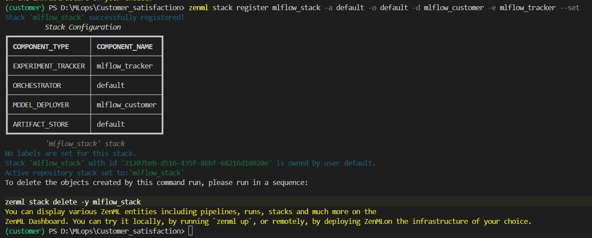
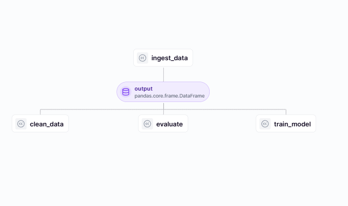
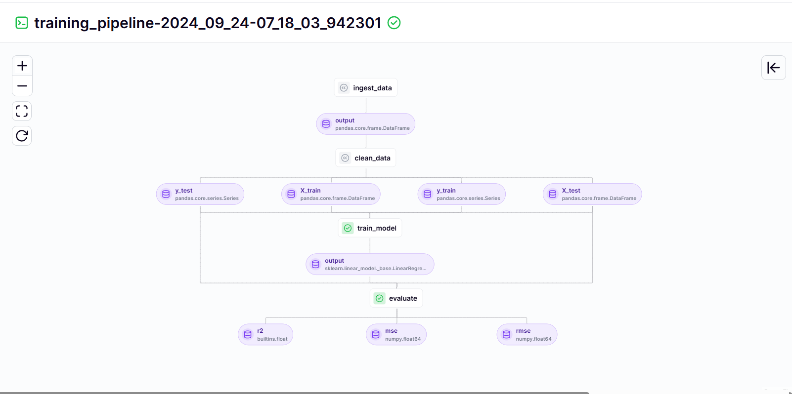

# Customer Satisfaction Prediction MLOps Project

This repository showcases an end-to-end MLOps project for predicting customer satisfaction. The project leverages **ZenML** and **MLflow** for managing the entire machine learning lifecycle. It includes a **Streamlit** app for making predictions and monitoring model performance with metrics like the R² score.

---

## Features

- **Pipeline Orchestration**: Built with ZenML for modular, reproducible pipelines.
- **Experiment Tracking**: Logs experiments, metrics, and artifacts using MLflow.
- **Performance Monitoring**: Tracks real-time R² scores and other metrics.
- **Automated Workflows**: Streamlined processes from data ingestion to model deployment.

---







## Tech Stack

- **Programming Language**: Python
- **Pipeline Framework**: ZenML
- **Experiment Tracking**: MLflow
- **Web App Framework**: Streamlit
- **Data Visualization**: Matplotlib, Seaborn
- **Deployment**: Docker (Optional for containerized deployment)

---

## Setup Instructions

### 1. Clone the Repository
```bash
git clone https://github.com/Yores24/MLops
cd customer-satisfaction-mlops
